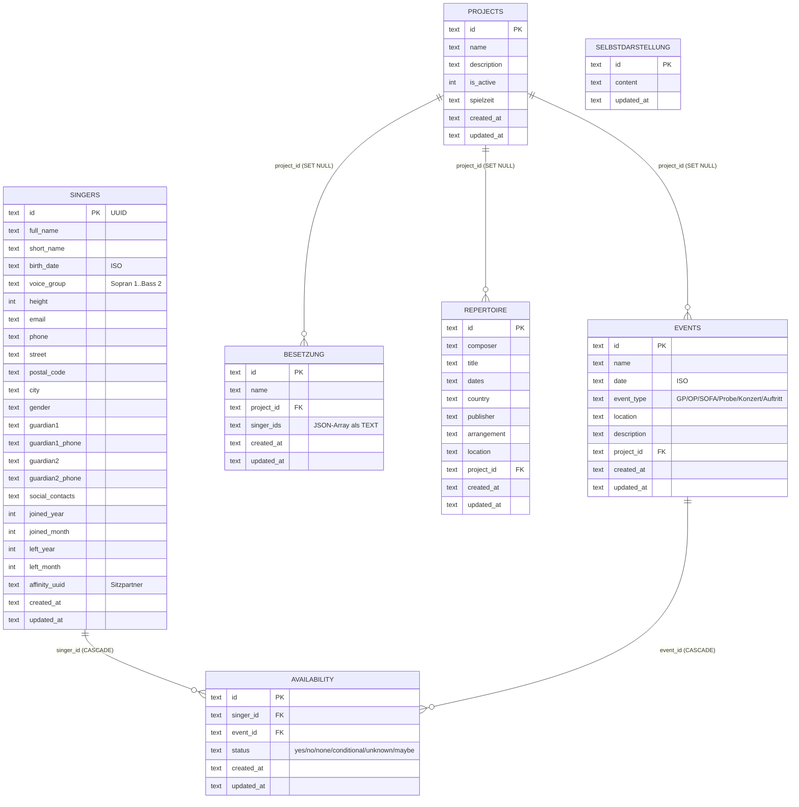

# M0: ERD + API-Kontrakte (Stand 2026-09-26, Branch `web-migration`)

**Status:** Kontrakt-Entwurf, keine Implementierung. Quelle: `chormanager/data/database.py:186-295`
(`Database.create_tables`), Eigner-Vorgaben 2026-09-26 (§5.1–§5.9 der Web-Migrationsanalyse).
**Ziel-DB:** MariaDB InnoDB utf8mb4 (s. Analyse §5.6). SQL portabel halten (keine PG-Typen).

## 1. ERD (Ist-Schema, 7 Tabellen)



**Auffälligkeiten für M1:**
- `UNIQUE(singer_id, event_id)` auf `availability` existiert bereits — trägt das Concurrent-Write-Modell der Sänger-Reserve (§3.4).
- `besetzung.singer_ids` ist ein JSON-Array in TEXT — aus Paritätsgründen in M1 unverändert übernehmen, Normalisierung (Join-Tabelle) erst bei Bedarf.
- IDs sind TEXT-UUIDs, Daten ISO-TEXT — MariaDB-Mapping 1:1 möglich (`TEXT`, `INT`, `DATETIME` für neue Zeitspalten).
- `spielzeit` + Adress-/Guardian-Spalten kamen per `ALTER TABLE`-Migration dazu (`database.py:297+`) — Alembic-Baseline in M1 muss den **migrierten** Endstand abbilden, nicht nur `create_tables`.

## 2. Geplante neue Tabellen (M1, noch nicht im Desktop)

| Tabelle | Zweck | Quelle |
|---|---|---|
| `formations` | Ersatz für Formations-JSONs in `choraufstellung/data/` (`rows`, `cols`, `staggered`, `voicing_config`, `placements` als JSON, `metadata`) | Analyse §7 |
| `voice_groups` | Eine Quelle für Stimmgruppen-Farben hell/dunkel (löst `voice_groups.yaml`+`.json`-Duplikat auf) | Analyse §5.4, §7 |
| `users` + `roles` | **Reserve, minimal befüllt:** genau 1 Chorleiter-User; Sänger-Portal später (§3.4) | Analyse §3.4, §5.8 |

## 3. API-Kontrakte (OpenAPI-Draft für M1, Gruppierung = Router)

```text
/singers                 GET (Liste+Filter), POST
/singers/{id}            GET, PUT, DELETE
/events                  GET (Projekt-Filter), POST
/events/{id}             GET, PUT, DELETE
/events/{id}/availability GET (Matrix), PUT (Bulk)
/projects                GET, POST
/projects/{id}           GET, PUT, DELETE
/projects/{id}/summary   GET (Zusagen-Auswertung je Stimmgruppe)
/besetzungen             GET, POST
/besetzungen/{id}        GET, PUT, DELETE
/repertoire              GET, POST
/repertoire/{id}         GET, PUT, DELETE
/selbstdarstellung       GET, PUT
/formations              GET, POST
/formations/{id}         GET, PUT, DELETE
/formations/{id}/placements PUT (Bulk, Autosave-Ziel)
/formations/{id}/optimize   POST (rule_ids -> Diff+Vorschau, s. §3.3)
/export/singers.csv      GET
/export/zusagen.pdf      GET (reportlab, Qualitätskriterien §5.3)
/export/zusagen.odt      GET
/export/sync.json        GET (Choraufstellung-Format, kompatibel)
/backup                  POST (anlegen), GET (Liste)
/backup/{id}/restore     POST
/config/voice-groups     GET, PUT (Admin)
/me/availability/{event_id} PUT (RESERVE Sänger-Portal, idempotent)
```

Konventionen: UUIDs als Pfad-IDs, ISO-8601-Daten, Bulk-Endpoints für Matrix/Placements,
`ETag`/`If-Match` (Revisions-Check Single-Editor, §5.2), Fehlerformat `{"detail": ...}` (FastAPI-Standard).

## 4. E2E-Basis (Playwright, implementiert in M3/M4, hier nur festgelegt)

- Smoke 1 (MS3): Login → Formation öffnen → Kachel per Drag verschieben → Undo → Optimizer-Diff übernehmen.
- Smoke 2 (MS4): Termin anlegen → Verfügbarkeiten bulk setzen → Zusagen-PDF laden (Status 200, `%PDF`-Header).
- Abnahmegerät: Notebook mit Maus/Trackpad (§5.1). Kein Mobile-Smoke in M0–M5.
